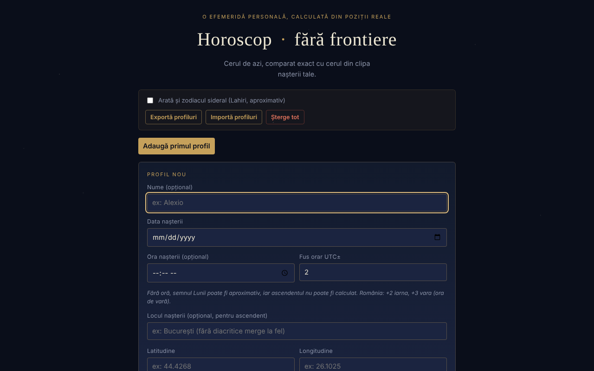

# Horoscop · fără frontiere

O efemeridă personală, calculată local din poziții planetare reale: cerul de azi, comparat cu cerul din clipa nașterii tale.

**Live:** https://chiuta.github.io/HoroScop/

## Ce este

Horoscop este o aplicație dintr-un singur fișier HTML care calculează în browser pozițiile Soarelui, Lunii și ale celor opt planete (elemente orbitale kepleriene, formule cu precizie redusă de tip Schlyter / Meeus), le compară cu tema natală a unui profil și compune o „citire" zilnică. Aplicația precizează în text că astrologia este tratată simbolic și că nu estimează riscuri de sănătate sau de mortalitate.

## Funcții

- Profiluri multiple (nume opțional, data, ora și fusul orar UTC±, locul nașterii cu latitudine/longitudine pentru ascendent): „Adaugă", „Editează", „Duplică", „Șterge".
- Citirea zilei pe secțiuni: Panorama, Suflet & relații, Muncă & bani, Trup & energie, Sfatul zilei; „Copiază citirea de azi".
- „Cerul de azi", „Săptămâna care vine" (cel mai puternic aspect pe zi), elemente de azi, retrograde, Luna goală de curs, eclipse posibile, cazimi / combust.
- Tema natală, structura temei, aspecte natale semnificative, rozeta aspectelor, orrery natal 3D (rotire prin tragere).
- Revoluții solare (de la naștere până azi și proiecție înainte), întoarceri Saturn / Jupiter / Lună.
- Compatibilitate (sinastrie) simplificată între două profile.
- „Muzica sferelor": fiecare planetă natală devine un ton („▶ Cântă tema ta" / „■ Oprește").
- „Portret cosmic": videoclip de aproximativ 6 secunde generat local, descărcabil ca `portret-cosmic.webm`.
- Opțiune pentru zodiacul sideral (Lahiri, aproximativ).
- Secțiune „Cum se calculează asta" cu precizia estimată și limitele (nu sunt calculate casele astrologice, doar ascendentul).

## Manual de utilizare

1. Apasă „Adaugă primul profil" (sau „Adaugă").
2. Completează data nașterii; opțional numele, ora, fusul orar UTC± (România: +2 iarna, +3 vara) și latitudinea/longitudinea locului. Fără oră, ascendentul nu poate fi calculat.
3. Apasă „Salvează profilul" (sau „Renunță").
4. Citește secțiunile zilei; „↻ Actualizează acum" recalculează cerul.
5. Bifează opțiunea pentru zodiac sideral dacă dorești.
6. Pentru muzică apasă „▶ Cântă tema ta"; pentru video „🎬 Generează portretul", apoi descarcă fișierul.
7. „Exportă profiluri" salvează profilurile într-un fișier; „Importă profiluri" le reîncarcă; „Șterge tot" le elimină. Tasta Escape închide formularul de profil (dacă există alte profiluri).

## Confidențialitate și rețea

- Local: profilurile se păstrează în `localStorage` (`horoscopFF_profiles_v1`, profilul activ `horoscopFF_active_v1`, opțiunea sideral `horoscopFF_sidereal_v1`). Dacă stocarea nu este disponibilă (mod privat), aplicația afișează un avertisment și profilurile nu se păstrează fără export.
- Rețea: în codul verificat nu există apeluri `fetch`, scripturi sau resurse externe; calculele se fac în browser.
- Interfața este în limba română.

## Rulare locală / offline

Descarcă `index.html` și deschide-l în browser; nu are nevoie de internet în codul verificat.

## Licență

Licența nu este încă declarată explicit în acest repository; vezi nota din aplicație.

## Autor

Alexio — Alexandru-Ionuț Chiuță, contact: alexio@trom.tf

## English summary

Horoscop · fără frontiere is a single-file Romanian-language personal ephemeris: it computes planetary positions in the browser, compares today's sky with a natal chart, and shows daily readings, aspects, solar returns, synastry, a 3D natal orrery, planet-tone music and a downloadable WebM portrait. Profiles live in localStorage with JSON export/import. No network requests were found in the code.
